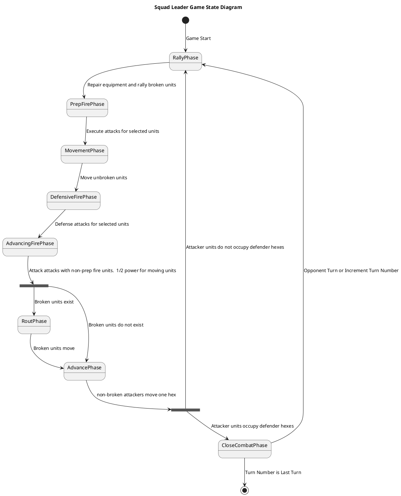

# SquadLeader

This is a game is an implementation of the Squad Leader board game, 4th edition.  It is a work in progress.

## Areas of Development

### Game Engine

Basic state machine for the game engine.

### Game Map

### Game Counters
